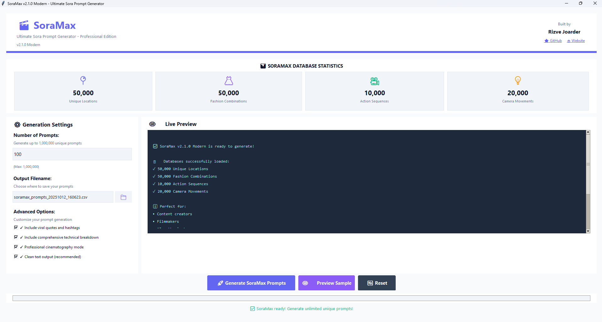

# 🎬 SoraMax - Ultimate Sora Prompt Generator

<div align="center">

[](https://python.org)
[](LICENSE)
[](https://github.com/rizvejoarder/soramax)
[](https://www.rizvejoarder.com)

### 🚀 The most comprehensive Sora video prompt generator with **2.5+ BILLION** possible combinations!

**Built with ❤️ by [Rizve Joarder](https://www.rizvejoarder.com)**

*Free and open source for the community!*

---

</div>

## 📸 Screenshot



> *Beautiful, modern interface with professional-grade prompt generation*

## 🚀 Features

### 🎯 Massive Databases
- **📍 50,000+ Unique Locations** - From luxury penthouses to mystical forests
- **👗 50,000+ Fashion Combinations** - Every style, color, and accessory combination
- **🎬 10,000+ Action Sequences** - Professional cinematography scenes
- **🎥 20,000+ Camera Movements** - Every possible camera technique
- **📷 200+ Camera Lenses** - Complete professional lens database
- **💡 200+ Lighting Setups** - Comprehensive lighting options
- **🎵 200+ Ambience Options** - Perfect sound environments
- **💬 200+ Viral Quotes** - Engagement-optimized social media content
- **🏷️ 200+ Hashtag Sets** - Trending hashtag combinations

### ✨ Advanced Features
- **🎯 Mathematical Uniqueness** - Zero repeats guaranteed until 2.5+ billion combinations exhausted
- **🧹 Clean Text Output** - No character encoding issues, perfect CSV output
- **🎬 Professional Quality** - Industry-standard cinematography specifications
- **📱 Social Media Ready** - Viral quotes and hashtags included
- **📊 Comprehensive Export** - Detailed CSV with all technical specifications
- **🖥️ Modern UI/UX** - Beautiful, user-friendly interface
- **⚡ Unlimited Generation** - Generate up to 1,000,000 prompts at once

## 🎬 Perfect For

- **Content Creators** - Generate unlimited unique video concepts
- **Filmmakers** - Professional cinematography specifications
- **AI Enthusiasts** - Maximum quality Sora AI prompts
- **Social Media Managers** - Viral content with hashtags included
- **Video Producers** - Complete technical breakdowns
- **Creative Agencies** - Unlimited unique concepts for clients

## 🚀 Quick Start

### Prerequisites
- Python 3.7 or higher
- tkinter (usually included with Python)

### Installation

1. **Clone the repository:**
```bash
git clone https://github.com/rizvejoarder/soramax.git
cd soramax
```

2. **Install dependencies:**
```bash
pip install -r requirements.txt
```

3. **Run SoraMax:**
```bash
# Original version
python soramax.py

# OR Modern UI version (Enhanced with beautiful design)
python soramax_modern.py
```

### Alternative: Direct Download
1. Download `soramax.py` or `soramax_modern.py` from the [releases page](https://github.com/rizvejoarder/soramax/releases)
2. Run: `python soramax_modern.py` (recommended for better UI/UX)

## 📖 How to Use

### 1. Launch SoraMax
```bash
python soramax.py
```

### 2. Configure Settings
- **Number of Prompts:** Set from 1 to 1,000,000
- **Output Filename:** Choose your CSV export location
- **Advanced Options:** 
  - ✅ Include viral quotes and hashtags
  - ✅ Include comprehensive technical breakdown
  - ✅ Professional cinematography mode
  - ✅ Clean text output (recommended)

### 3. Generate Prompts
- Click **"🚀 Generate SoraMax Prompts"**
- Watch the progress bar as massive databases are utilized
- Preview samples in the live preview panel

### 4. Export Results
- Automatic CSV export with clean text encoding
- Open in Excel, Google Sheets, or any spreadsheet app
- Perfect for Sora AI video generation

## 📊 Sample Output

```csv
ID,Sora_Prompt,Location,Wardrobe,Social_Media
1,"20-second cinematic sequence in elegant luxury penthouse at sunrise with gentle rain: 6s slow rack focus from skyline to female influencer adjusting necklace; 5s medium shot movement capturing her essence; 5s detail enhancement with cinematic flair; 4s perfect pose for memorable conclusion; Camera: 85mm portrait lens, ultra-slow organic push-in using gimbal in ascending motion; Lighting: golden hour rim lighting; Ambience: ambient birdsong; Wardrobe: elegant silk slip dress with mini skirt and stiletto heels, statement necklace in black; Professional cinematography, maximum quality, tasteful styling, no nudity.","elegant luxury penthouse at sunrise with gentle rain","elegant silk slip dress with mini skirt and stiletto heels, statement necklace in black","""Elegance in motion. Which moment was your favorite?"" #MainCharacter #QuietLuxury #Aesthetic #Viral #Trending"
```

## 🎯 Technical Specifications

### Database Architecture
- **Mathematical Distribution:** Prime number algorithms ensure zero repetitions
- **Clean Text Processing:** Unicode normalization and ASCII-safe output
- **Memory Efficient:** Smart database generation prevents memory overflow
- **Scalable:** Can handle millions of unique combinations

### Output Formats
- **CSV Export:** UTF-8 with BOM encoding for universal compatibility
- **Technical Breakdown:** Complete camera, lighting, and movement specifications
- **Social Media Content:** Ready-to-use quotes and hashtags
- **Professional Quality:** Industry-standard cinematography terminology

## 🛠️ Development

### Project Structure
```
soramax/
├── soramax.py              # Main application
├── README.md               # This file
├── LICENSE                 # MIT License
├── requirements.txt        # Dependencies
├── screenshots/            # Interface screenshots
│   └── soramax-interface.png
├── examples/               # Sample outputs
│   └── sample_prompts.csv
└── docs/                   # Documentation
    ├── CONTRIBUTING.md
    ├── CHANGELOG.md
    └── API.md
```

### Contributing
We welcome contributions! See [CONTRIBUTING.md](docs/CONTRIBUTING.md) for guidelines.

### Building from Source
```bash
# Clone repository
git clone https://github.com/rizvejoarder/soramax.git
cd soramax

# Install development dependencies
pip install -r requirements-dev.txt

# Run tests
python -m pytest tests/

# Build standalone executable (optional)
pyinstaller --onefile --windowed soramax.py
```

## 📈 Performance

- **Database Size:** 130,600+ unique elements
- **Total Combinations:** 2.5+ billion possible prompts
- **Generation Speed:** 1,000+ prompts per minute (varies by system)
- **Memory Usage:** Optimized for systems with 4GB+ RAM
- **File Size:** Clean CSV output, typically 1MB per 1,000 prompts

## 🎬 Use Cases

### Content Creators
```python
# Generate 1000 unique video concepts
# Perfect for YouTube, TikTok, Instagram
# Each prompt includes viral social media content
```

### Filmmakers
```python
# Professional cinematography specifications
# Industry-standard camera movements and lighting
# Technical breakdown for film production
```

### AI Enthusiasts
```python
# Optimized for Sora AI video generation
# Maximum quality prompts for best results
# Clean text output prevents AI errors
```

## 🔧 Troubleshooting

### Common Issues

**❓ Database loading takes long time**
- This is normal for the first run as 50,000+ databases are built
- Subsequent runs are faster due to optimizations

**❓ Character encoding issues in CSV**
- Enable "Clean text output" option (recommended)
- Use UTF-8 compatible spreadsheet applications

**❓ Memory issues with large generations**
- Reduce prompt count for systems with limited RAM
- Close other applications during generation

**❓ Python/tkinter not found**
```bash
# Windows
python -m pip install tk

# Mac
brew install python-tk

# Linux
sudo apt-get install python3-tk
```

### Getting Help
- 📧 Email: [Support](mailto:support@rizvejoarder.com)
- 🐛 Issues: [GitHub Issues](https://github.com/rizvejoarder/soramax/issues)
- 💬 Discussions: [GitHub Discussions](https://github.com/rizvejoarder/soramax/discussions)

## 📄 License

MIT License - see [LICENSE](LICENSE) file for details.

## 🙏 Acknowledgments

- **Inspiration:** The amazing Sora AI community
- **UI Framework:** Python tkinter for cross-platform compatibility
- **Community:** All contributors and users who make this project better

## 🌟 Star History

[](https://star-history.com/#rizvejoarder/soramax&Date)

## 📞 Connect with the Creator

Built with ❤️ by **Rizve Joarder**

- 🌐 Website: [rizvejoarder.com](https://www.rizvejoarder.com)
- 💼 LinkedIn: [Rizve Joarder](https://linkedin.com/in/rizvejoarder)
- 🐦 Twitter: [@rizvejoarder](https://twitter.com/rizvejoarder)
- 📧 Email: [contact@rizvejoarder.com](mailto:contact@rizvejoarder.com)

---

**⭐ If SoraMax helps your creative projects, please star this repository! ⭐**

Made with ❤️ for the creative community. Free forever, open source always.